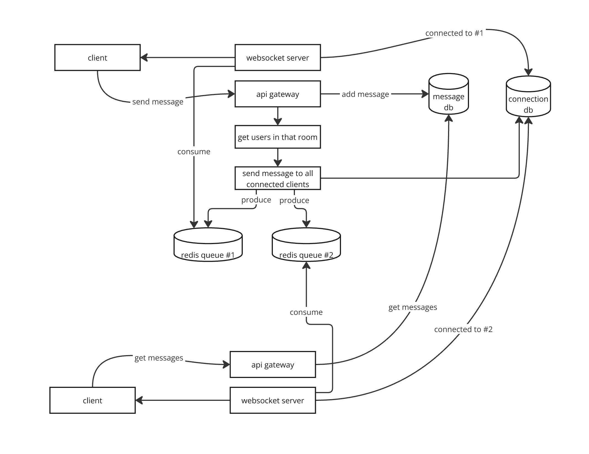

# Chat Application
This is a simple command-line chat application that supports multiple chat rooms and allows users to send messages in real-time. The interface displays the list of rooms on the left and the chat messages on the right.

## How to Use
Run the Application:
```
./run_client <username>
```
## Features
* Multiple Chat Rooms: Create and join multiple chat rooms to facilitate organized conversations.
* Real-time Messaging: Send and receive messages in real-time.
* User Identification: Each message is tagged with the sender's username and a timestamp.
* Command-line Interface: Lightweight and easy-to-use interface that runs in the terminal.
* Create/Join Rooms: Use the room list on the left to join an existing room or create a new one.
* Send Messages: Type your message in the input field at the bottom and hit Enter to send.

## Screenshots


## How it works?



## Contributing
Feel free to submit issues and pull requests.